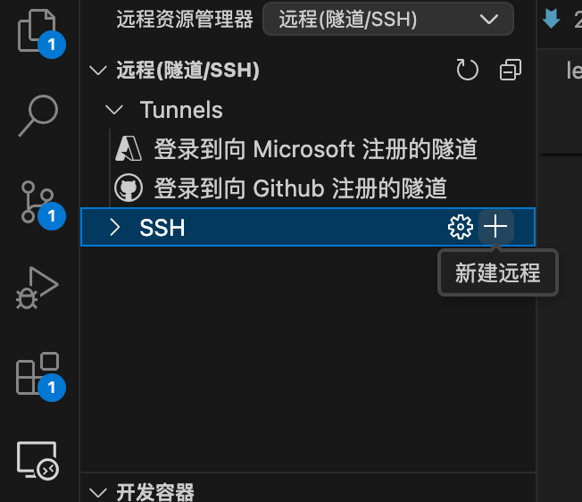

# 每周一道算法题：
## [leetcode 24 两两交换链表节点](https://leetcode.cn/problems/swap-nodes-in-pairs/description/?utm_source=LCUS&utm_medium=ip_redirect&utm_campaign=transfer2china)
```Java
class Solution {
  public ListNode swapPairs(ListNode head) {
    if (head == null || head.next == null) {
      return head;
    }
    ListNode res = head;
    int temp;
    while (head.next != null) {
      temp = head.val;
      head.val = head.next.val;
      head.next.val = temp;
      if (head.next.next != null) {
        head = head.next.next;
      } else {
        break;
      }
    }
    return res;
  }
}
```

# 每周一篇文章点评：
[6 Tips for Resolving Common Java Performance Problems（Java 性能问题优化手段）](https://medium.com/javarevisited/6-tips-for-resolving-common-java-performance-problems-b88f42dc6118)

优化 Java 性能问题的措施：  
- 防止内存泄漏，确保不再使用的对象被回收
- 优化 JVM 垃圾回收，根据需求配置 JVM 参数，选择合适的垃圾回收算法
- 避免线程死锁，确保一致的锁获取顺序，使用超时机制避免无限等待
- 减少臃肿的库和依赖，清理不必要的依赖
- 优化SQL查询和数据库访问，大量数据批量处理，使用连接池复用数据库连接
- 根据需求选择合适的数据结构


# 每周一个小技巧：
使用vscode进行远程开发：  
1. 安装 Remote SSH 扩展或者 Remote Development 扩展

2. 配置 SSH，点击新建远程输入 SSH 命令

例如：**ssh crebest@192.168.31.72**


# 每周一篇学习分享：

### Spring Event 实现事件监听

Spring Event 是 Spring 框架提供的一种事件发布机制，通过发布事件来触发监听器，从而实现解耦。
#### 定义事件：用户注册
```Java
@Getter
@Setter
public class RegisterEvent extends ApplicationEvent {
  private final User user;

  public RegisterEvent(Object source, User user) {
    super(source);
    this.user = user;
  }
}
  ```
  #### 定义 Publisher 发布事件，实现 ApplicationEventPublisherAware 接口
  ```Java
  @Component
  @Service
public class RegisterPublisher implements ApplicationEventPublisherAware {
  private ApplicationEventPublisher applicationEventPublisher;

  @Override
  public void setApplicationEventPublisher(ApplicationEventPublisher applicationEventPublisher) {
    this.applicationEventPublisher = applicationEventPublisher;
  }

  public void publishLogin(User user) {
    applicationEventPublisher.publishEvent(new RegisterEvent(this, user));
  }
}
```
#### 通过实现 ApplicationListener 接口来定义监听器
```Java
@Service
public class NoticeService implements ApplicationListener<RegisterEvent> {
  @Override
  @Async//可选异步执行
  public void onApplicationEvent(RegisterEvent event) {
    // 用户登录通知
  }
}
```
#### 通过 @EventListener 注解来定义监听器
```Java
@Service
public class RegisterInitService {
  @EventListener
  public void registerInit(RegisterEvent event){
    //用户注册初始化
}
}
```
