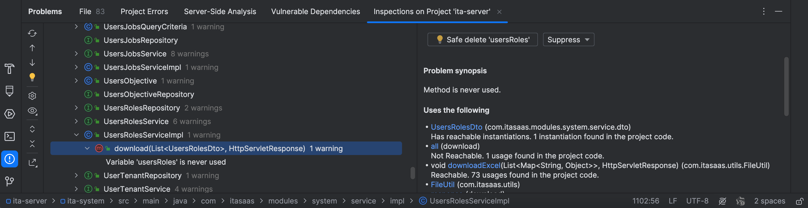

# 每周一道算法题：

[39. 组合总和](https://leetcode.cn/problems/combination-sum/)

```Java
class Solution {
  public List<List<Integer>> combinationSum(int[] candidates, int target) {
    List<List<Integer>> res = new ArrayList<>();
    dfs(candidates, target, res, new ArrayList<>(), 0);
    return res;
  }

  private void dfs(int[] candidates, int target, List<List<Integer>> res,
                          List<Integer> item, int idx) {
    if (target == 0) {
      res.add(new ArrayList<>(item));
      return;
    }
    if (target > 0) {
      for (int j = idx; j < candidates.length; j++) {
        item.add(candidates[j]);
        target = target - candidates[j];
        dfs(candidates, target, res, item, idx++);
        target = target + candidates[j];
        item.removeLast();
      }
    }
  }
}
```

# 每周一篇文章点评：

优化if-else语句的最佳实践

[Optimizing 10,000 If-Else Statements: Strategies and Best Practices](https://www.linkedin.com/pulse/optimizing-10000-if-else-statements-strategies-best-practices-asim-ammgf)

- 使用 map
- 使用抽象类
- 使用决策表

# 每周一个小技巧：

IDEA 清理未使用的声明 

Code -> Analyze Code -> Run inspection by name

输入 unused declaration 查找未使用过的类、方法：



# 每周一篇学习分享：

使用 `RedisTemplate` 实现批量获取

1. 使用`opsForValue`批量获取

   ```java
    List<String> keys = Arrays.asList("key1", "key2", "key3");
    List<Object> objects= redisTemplate.opsForValue().multiGet(keys);
   //可选转换成map
    Map<String, Object> map = new HashMap<>();
    for (String k : keys) {
      if (ObjectUtil.isNotNull(k)) {
        map.put(k, objects.get(keys.indexOf(k)));
      }
    }
   ```

2. 对于 hash 类型，不支持批量获取多个 key 的的值，可以通过 pipeline 批量获取多个 key 的值。
   ```java
    List<String> keys = Arrays.asList("key1", "key2", "key3");
    Map<String, Map<String, Object>> result = new HashMap<>();
    //从redis中批量获取
    List<Object> resultList = redisTemplate.executePipelined((RedisCallback<Void>) connection -> {
      keys.forEach(k -> {
        connection.hGetAll(k.getBytes());
      });
      return null;
    });
   
    for (int i = 0; i < resultList.size(); i++) {
      Object rawResult = resultList.get(i);
      if (rawResult instanceof Map) {
        result.put(keys.get(i), (Map<String, Object>) rawResult);
      }
    }
    return result;
   ```