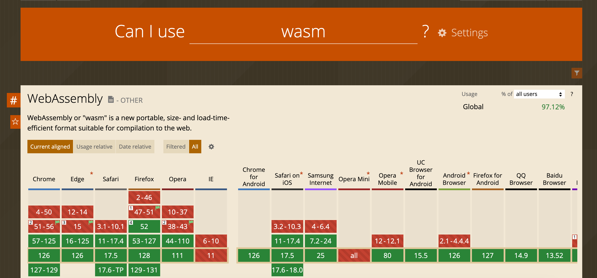

# 每周一道算法题：

[40. 组合总和II](https://leetcode.cn/problems/combination-sum-ii/description/)_

```Java
class Solution {
     public List<List<Integer>> combinationSum2(int[] candidates, int target) {
    List<List<Integer>> res = new ArrayList<>();
    Arrays.sort(candidates);
    boolean[] include = new boolean[candidates.length];
    Arrays.fill(include, false);
    dfs(candidates, target, res, new ArrayList<>(), 0, include);
    return res;
  }

  private void dfs(int[] candidates, int target, List<List<Integer>> res,
                          List<Integer> item, int idx, boolean[] include) {
    if (target < 0) {
      return;
    }
    if (target == 0) {
      res.add(new ArrayList<>(item));
      return;
    }
    for (int j = idx; j < candidates.length; j++) {
      if (j > 0 && candidates[j - 1] == candidates[j] && !include[j - 1]) {
        continue;
      }
      item.add(candidates[j]);
      include[j] = true;
      dfs(candidates, target - candidates[j], res, item, j + 1, include);
      include[j] = false;
      item.removeLast();
    }
  }
}
```

# 每周一篇文章点评：

使用 tracing agent 配置反射

[Introducing the Tracing Agent: Simplifying GraalVM Native Image Configuration](https://medium.com/graalvm/introducing-the-tracing-agent-simplifying-graalvm-native-image-configuration-c3b56c486271)

graalvm 不支持直接运行包含反射的 Java 代码，使用 tracing agent 在 jvm 上运行程序以收集反射信息，生成配置文件，这样编译出来的 native image 可以支持反射

# 每周一个小技巧：

查询浏览器兼容性

https://caniuse.com/



# 每周一篇学习分享：

SpringCache多租户缓存设计

1. 多租户场景下只用 id 作为 key 存在的问题

   以用户对应的角色为例，user_id 作为 key ，角色列表作为 value，保存在 redis 中，当用户在不同租户中时，缓存中的角色没有做租户隔离，会获取到其他租户的角色

2. 解决方案：自定义 RedisCacheManager，重写 getCache 方法，加入租户隔离

```java
public class CustomCacheManager extends RedisCacheManager {
  public CustomCacheManager(RedisCacheWriter cacheWriter,
                            RedisCacheConfiguration defaultCacheConfiguration) {
    super(cacheWriter, defaultCacheConfiguration);
  }

  @Override
  public Cache getCache(String name) {
    //获取租户id作为前缀
    Long tenantId = TenantContext.getCurrentTenant();
    if (tenantId != null) {
      name = tenantId + ":" + name;
    }
    return super.getCache(name);
  }
}
```

