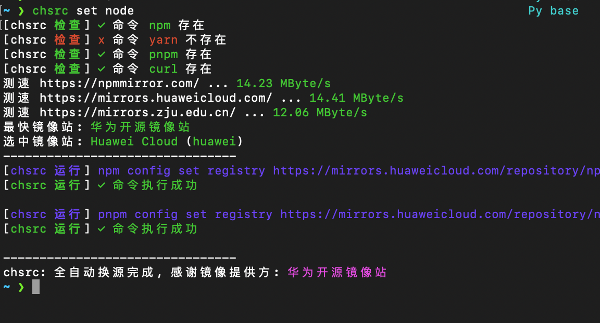

# 每周一道算法题：

[56. 合并区间](https://leetcode.cn/problems/merge-intervals/)

```Java
class Solution {
  public int[][] merge(int[][] intervals) {
    if (intervals == null && intervals.length == 1) {
      return intervals;
    }
    Arrays.sort(intervals, Comparator.comparing(ints -> ints[0]));
    List<int[]> stack = new ArrayList<>();
    for (int i = 0; i < intervals.length; i++) {
      if (stack.isEmpty()) {
        stack.addLast(intervals[i]);
      } else {
        int[] last = stack.getLast();
        if (last[1] >= intervals[i][0]) {
          last[1] = Math.max(intervals[i][1], last[1]);

        } else {
          stack.addLast(intervals[i]);
        }
      }
    }
    return stack.toArray(new int[0][0]);
  }
}
```

# 每周一篇文章点评：

[Speed of Java stream](https://medium.com/@denhox/sharing-data-between-microservices-fe7fb9471208)

使用stream流和foreach进行集合处理的性能差异，简单任务使用foreach性能更强，数据量大的时候并行stream有优势

# 每周一个小技巧：

自动配置镜像源的工具[chsrc](https://github.com/RubyMetric/chsrc)，可以配置npm、maven、pip等镜像源，自动测速并选择最快的地址



# 每周一篇学习分享：

#### 乐观锁

适用于多个事务并发修改读多写少场景，使用版本号控制，读取时不受影响，修改时检查版本号是否一致，不一致则更新失败，以库存场景为例
1. 库存定义添加版本号
   ```sql
   CREATE TABLE `product` (
   `id` int(11) NOT NULL AUTO_INCREMENT COMMENT '主键',
   `count` int(11) DEFAULT NULL COMMENT '库存数量',
   `version` int(11) DEFAULT NULL COMMENT '版本号',
   PRIMARY KEY (`id`)
   ) ENGINE=InnoDB AUTO_INCREMENT=1 DEFAULT CHARSET=utf8mb4 COMMENT='商品表';
   ```
2. 更新的时候检查版本号是否一致
   ```sql
   UPDATE product SET count = count - 1, version = version + 1 WHERE id = 1 AND version = 1;   
   ```
   通过影响行数判断是否更新成功，如果影响行数为0，则表示更新失败
3. 重试机制
   ```java
   while (true) {
    try {
        updateRecord();
        break; // 更新成功，退出循环
    } catch (OptimisticLockingFailureException e) {
        // 更新失败，继续尝试
    }
   }